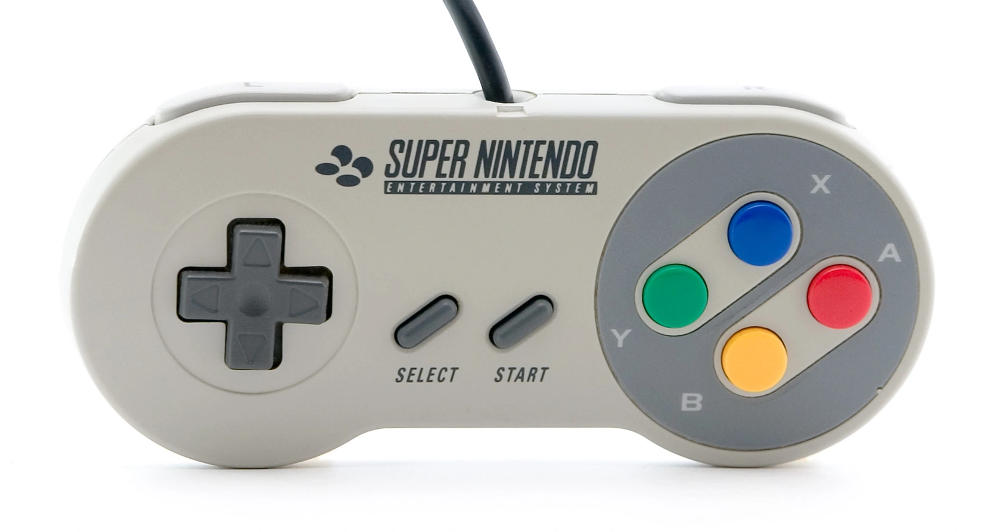

# Super Mario World - Reinforcement Learning

## 🌐 Overview:
This project aims to create a bot that will be trained through reinforcement learning to complete the first scenario of the "Yoshi's Island" map in the game "Super Mario World".

## 🧩 Key Mapping:
The "actions" parameter of env.step() expects a binary array of 12 positions. In the case of the Super Nintendo (SNES), the exact order of the positions in this array represents the following buttons:

* i[0] = B
* i[1] = Y
* i[2] = SELECT
* i[3] = START
* i[4] = UP
* i[5] = DOWN
* i[6] = LEFT
* i[7] = RIGHT
* i[8] = A
* i[9] = X
* i[10] = Left Corner
* i[11] = Right Corner

## 🧠 Proximal Policy Optimization (PPO)
The Proximal Policy Optimization (PPO) from stable-baselines3 (SB3) is one of the most popular and efficient implementations for Reinforcement Learning. It is an On-Policy algorithm, meaning it learns directly from the experiences it is collecting in real time, rather than reusing old memories.

## 🎲 Scenario:
The levels in Super Mario World (Dinosaur Land) are divided into 7 main worlds and 2 secret areas, totaling 96 exits. The locations are:

1. Yoshi's Island.
2. Donut Plains.
3. Vanilla Dome.
4. Twin Bridges.
5. Forest of Illusion.
6. Chocolate Island.
7. Valley of Bowser.

## 🐍 Python Version:
3.10.16

## 🔨 Tools:
* Stable Retro.
* Stable Baselines3.
