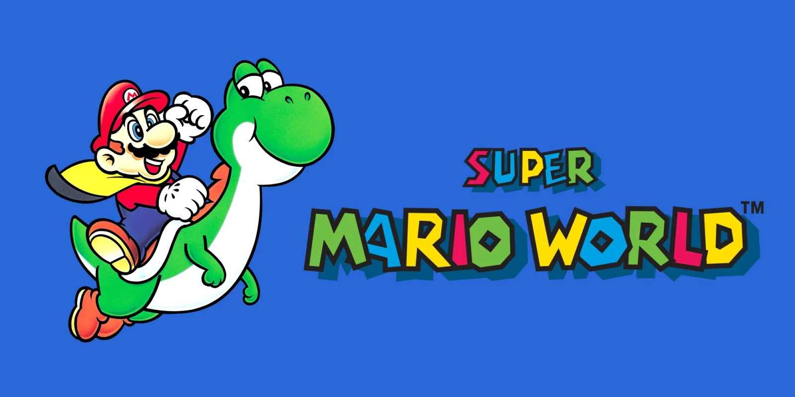

# Super Mario World - Reinforcement Learning

## 🌐 Overview:
This project aims to create a bot that will be trained through reinforcement learning to complete the first scenario of the "Yoshi's Island" map in the game "Super Mario World".

# 🎲 Scenario:
The levels in Super Mario World (Dinosaur Land) are divided into 7 main worlds and 2 secret areas, totaling 96 exits. The locations are:

1. Yoshi's Island.
2. Donut Plains.
3. Vanilla Dome.
4. Twin Bridges.
5. Forest of Illusion.
6. Chocolate Island.
7. Valley of Bowser.

## 🔨 Tools:
* Stable Retro.
* Stable Baselines3
